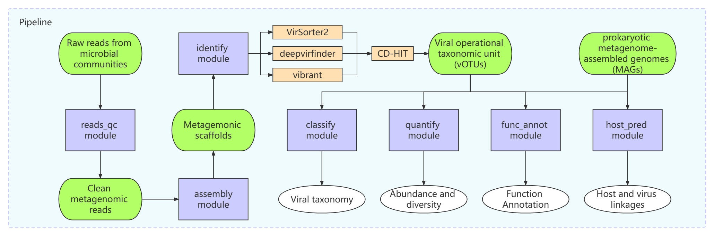

# VirCraft
VirCraft是一个自动化病毒组学分析流程软件。  
VirCraft is an automatic viromic analysis pipeline.

## 1 软件安装和数据库部署

#### 1.1 VirCraft所需软件

表1-1 VirCraft使用的软件
|Tool|Version|Modules|Note|
|:----|:----|:----|:----|
|bedtools|2.30.0|identify|用于处理基因组信息分析的强大工具集合|
|blast|2.13.0|classify|序列比对|
|bowtie2|2.4.4|assembly|比对参考序列|
|BWA|0.7.17-r1188|assembly|比对参考基因组|
|cd-hit|4.8.1|votus|序列聚类或去冗余|
|checkv|1.0.1|identify|votus|病毒序列质控和修剪|
|coverm|0.6.1|vir_quant|计算TPM丰度信息|
|diamond|2.0.14|classify|序列比对|
|dram|1.4.6|identify|func_annot|AMGs预测|
|eggnog-mapper|2.1.10|identify|基因功能注释|
|fastp|0.23.2|read_qc|原始测序数据质量控制|
|fastuniq|1.1|read_qc|去除重复reads|
|GTDB-tk|1.7.0|host_pred|用于生成进化树文件用于宿主预测|
|hmmer|3.3.2|identify|host_pred|序列比对|
|iqtree|2.2.0.3|func_annot|建树|
|kofamscan|1.3.0|func_annot|基因功能注释|
|MEGAHIT|1.2.9|assembly|宏基因组组装|
|prodigal|2.6.3|identify|compare|func_annot|基因预测|
|salmon|0.14.2|gene_quant|不基于比对而直接对基因进行定量|
|sortmerna|4.3.4|read_qc|去除FASTQ数据中的rRNA|
|SPAdes|3.15.4|assembly|宏基因组组装|
|Trimmomatic|0.39|read_qc|修剪FASTQ数据以及去除接头序列|
|trnascan-se|2.0.11|host_pred|用于基因组注释tRNA分子|
|vContact2|0.9.22|compare|用于病毒分类和比较|
|vibrant|1.2.1|identify|识别裂解病毒基因组和整合前病毒|
|virsorter2|2.2.4|identify|病毒序列判定|

#### 1.2 VirCraft环境部署

###### 1.2.1 reads_qc

conda env create -f install/reads_qc.yaml

###### 1.2.2 assembly

conda env create -f install/assembly.yaml

###### 1.2.3 identify

模块identify鉴定病毒contigs主要依赖VirSorter2、VIBRANT和DeepVirFinder三种软件。

1) VirSorter2的
```
#安装viral-id-sop所需软件
conda env create -f install/viral-id-sop.yaml

#配置viral-id-sop相关数据库
conda activate viral-id-sop
cd /absolute/path/to/store/database
mkdir dramDB virsorter2DB checkvDB
DRAM-setup.py prepare_databases --skip_uniref --output_dir dramDB #DRAMv database setup can take a long time ~5h and ~60GB of memory.
virsorter setup -d db-vs2 -j 4
checkv download_database checkvDB #CheckV database takes ~6 mins and 1.27 GB of memory
```

2) VIBRANT
```
#安装vibrant环境和软件
conda env create -f install/vibrant.yaml

#2.部署vibrant数据库
conda activate vibrant
download-db.sh #It will take 40 mins and ~11 GB memory
```

3) DeepVirFinder
```
#安装DeepVirFinder环境和软件
conda env create -f install/deepvirfinder.yaml
# or
conda create --name deepvirfinder python=3.6 numpy theano=1.0.3 keras=2.2.4 scikit-learn Biopython h5py
# then
cd /absolute/path/to/store/software
git clone https://github.com/jessieren/DeepVirFinder.git
cd DeepVirFinder
chmod 755 *.py
echo 'export PATH=/absolute/path/to/store/software/DeepVirFinder:$PATH' >> ~/.bashrc
```

###### 1.2.4 classify

```
#安装vcontact2软件
conda env create -f vContact2.yaml
conda activate vContact2
cd /absolute/path/to/store/software
git clone https://bitbucket.org/MAVERICLab/vcontact2
cd vcontact2 && pip install .
```

###### 1.2.5 VirCraft 

```
#安装VirCraft基本组件
conda env create -f install/VirCraft.yaml
```

###### 1.2.5 host_pred

GTDB-tk主要用于构建进化树作为VirMatcher的输入文件。
```
#安装gtdbtk环境和软件
conda env create -f gtdbtk.yaml
cd  
wget https://data.gtdb.ecogenomic.org/releases/latest/auxillary_files/gtdbtk_v2_data.tar.gz
wget https://data.ace.uq.edu.au/public/gtdb/data/releases/latest/auxillary_files/gtdbtk_v2_data.tar.gz  (or, mirror)
tar xvzf gtdbtk_v2_data.tar.gz
#Note that different versions of the GTDB release data may not run on all versions of GTDB-Tk, check the supported versions!
```

VirMatcher用于预测病毒宿主关系并给出打分。
```
#安装virmatcher
conda activate VirCraft
conda install -c bioconda -c conda-forge minced blast trnascan-se r-here r-seqinr r-dplyr r-data.table r-stringr pandas biopython psutil
git clone https://github.com/soedinglab/WIsH.git && cd WIsH && cmake . && make && chmod +x WIsH && cp WIsH $CONDA_PREFIX/bin
git clone https://bitbucket.org/MAVERICLab/virmatcher && cd virmatcher && pip install . --no-deps
conda create -y -n vibrant -c bioconda vibrant
```

## 2 软件结构和基本使用方法

#### 2.1 软件结构

###### 2.1.1 软件结构图



###### 2.1.2 软件目录结构

```
.
├── bin #自制脚本合集
│   ├── abd_by_taxa.py #统计各个分类单元的相对丰度
│   ├── alpha_diversity.R #计算alpha多样性统计表
│   ├── barplot_for_taxa_tpm.R #物种丰度柱状图脚本
│   ├── blast_classify.py #基于Blastp的病毒分类脚本
│   ├── db #基因数据库
│   │   ├── __init__.py
│   │   ├── suspGenes.py #存储可疑基因列表用于病毒序列判定
│   │   └── suspicious-gene.list #存储可疑基因列表用于病毒序列判定
│   ├── demovir.R #demovir的R语言脚本
│   ├── demovir.sh #demovir的bash脚本
│   ├── extract_name.py #用于提取物种名的脚本
│   ├── extract_pid_sp_from_faa.py -> extract_name.py #用于提取物种名的脚本
│   ├── extrSeqByName.pl #根据序列名称提取FastA文件中的序列并输出FASTA文件
│   ├── fa_length_tpm_scatter.R #散点图绘图脚本
│   ├── fasta2phylip.pl #FastA转换为phylip格式
│   ├── fasta_size_distribution_plot.py #序列长度分布图绘图程序
│   ├── fasta_size_gc.py #序列长度和GC含量计算程序
│   ├── filtByViralPredictionTools.py #用于从WtP结果中提取阳性病毒序列的程序
│   ├── linkTab.py #根据字段连接表格的程序
│   ├── merge_taxa.pl #合并NCBI BLAST和DemoVir病毒分类结果
│   ├── merge_tpms.pl #合并所有样本的TPM生成vOTUs丰度表
│   ├── NMDS.R #NMDS分析程序
│   ├── ntw_annot.pl #vContact注释脚本
│   ├── pheatmap_for_abd.R #热图绘制程序
│   ├── renameMergeSeq.pl #vOTU序列重命名程序
│   ├── sam_to_fastq.py #sam文件转换为fastq
│   ├── SeqLenCutoff.pl #根据长度过滤Scaffolds程序
│   ├── specTab4barplot.py -> abd_by_taxa.py
│   ├── stat_N50.pl #计算Scaffolds的N50等指标
│   ├── sum_abd_by_seq_bk.py #无用的备份
│   ├── sum_abd_by_seq.py -> sumAbundance.py
│   ├── sum_abd_by_taxa_bk.py #无用的备份
│   ├── sum_abd_by_taxa.py -> abd_by_taxa.py
│   ├── sumAbundance.py #tpm按物种
│   ├── taxa_annot_abd.py -> tpmAddSource.py
│   ├── tpmAddSource_bk.py #tpm求和程序的备份
│   ├── tpmAddSource.py #tpm按物种纵向求和程序保留各个样本
│   ├── usearch -> usearch11.0.667_i86linux32 #usearch软件链接
│   ├── usearch11.0.667_i86linux32 #usearch软件
│   ├── variables_scatter.R #通用散点图绘图脚本
│   ├── vCurator-dev.py #病毒序列判定程序（基于vir-id-sop）开发版
│   ├── vCurator.py #病毒序列判定程序（基于vir-id-sop）
│   ├── virus2csv.py #用于制备vContact输入文件
│   ├── viruse_tax.py #NCBI病毒RefSeq数据库处理程序
│   └── virus_identity.py #根据关键字过滤病毒的程序
├── conda.list #conda软件列表
├── crafts #各个分析模块，详见"3 软件模块功能、用法和结果说明"
│   ├── assembly/
│   │   ├── assembly.py
│   │   ├── __init__.py
│   ├── classify/
│   │   ├── classify.py
│   │   ├── __init__.py
│   │   └── vCont.py
│   ├── config/
│   │   ├── arguments.py
│   │   ├── config.py
│   │   ├── getOpts.py
│   │   ├── __init__.py
│   │   └── vircraft.cfg
│   ├── data/
│   │   ├── bioseq.py
│   │   ├── fastqc.py
│   │   ├── __init__.py
│   ├── func_annot/
│   │   ├── callAMGs.py
│   │   ├── geneAnnot.py
│   │   ├── __init__.py
│   ├── general/
│   │   ├── __init__.py
│   │   └── utils.py
│   ├── host/
│   │   ├── hosts.py
│   │   └── __init__.py
│   ├── identify/
│   │   ├── __init__.py
│   │   ├── viridsop.py
│   │   └── wtpsop.py
│   ├── __init__.py
│   ├── quantify/
│   │   ├── alnQuant.py
│   │   ├── geneQuantStat.py
│   │   ├── __init__.py
│   │   ├── multiQuant.py
│   │   └── virQuantStat.py
│   ├── summary/
│   │   └── statPlot.py
│   └── votus/
│       ├── __init__.py
│       └── votus.py
├── docs #图片表格等文件存储目录
│   └── Overall_workflow_of_VirCraft.png #软件结构图
├── download_databases.sh #数据库部署程序，开发中...
├── example #VirCraft示例脚本和输入文件
│   ├── run_vircraft.sh #VirCraft示例脚本
│   └── sample_info.xls #样本信息文件
├── install.sh #依赖安装程序
├── LICENSE #许可
├── README.md #本说明文档
├── requirements.min.txt #最小化的python模块列表
├── requirements.txt #python模块列表
├── setup.py #build脚本，开发中...
├── virCraft.py #主程序
└── VirCraft.yaml #VirCraft环境文件
```

#### 2.2 软件基本使用方法

当所有依赖的软件和数据库准备就绪，VirCraft使用起来就比较简单了。VirCraft主程序脚本（virCraft.py）不包含任何功能模块，使用者可以单独使用这些模块。

```
virCraft.py -h
usage:
        ./virCraft.py -h [<options>] -o <outdir>
        subcommands: an optional functional module, including assembly, identify, votus, classify, compare, vir_quant, func_annot and host_prid.
        options: options described below in the section of Options.
        outdir: output directory.

VirCraft is an flexible pipeline for metaviromic data analysis.

optional arguments:
  -h, --help            show this help message and exit

subcommands:
  valid subcommands

  {reads_qc,assembly,identify,votus,classify,compare,vir_quant,func_annot,host_prid}
    reads_qc            Pair-end FastQ reads qualitiy control.
    assembly            Assemble the reads to contigs or scaffolds using
                        MegaHit and/or SPAdes
    identify            identify the viral contigs from a assembly fasta,
                        using vir-id-sop
    votus               construct the non-redundant virus operational
                        taxonomic unit (vOTU) reference
    classify            classify the virus contigs by Demovir
    compare             Compare the virus protein sequence by vContact2
    vir_quant           Calculate the abundance and diversity of each
                        microbial community
    func_annot          Gene annotation and quantification
    host_prid           Predict the hosts of virus
```

各个模块可单独运行。例如，运行identify（病毒鉴定）模块。

```
usage: ./virCraft.py identify [<options>] -o <outdir>
        subcommands: an optional functional module, including assembly, identify, votus, classify, compare, vir_quant, func_annot and host_prid.
        options: options described below in the section of Options.
        outdir: output directory. identify
        [-h] [-a STR] [-t INT] -o STR

optional arguments:
  -h, --help            show this help message and exit
  -a STR, --fasta STR   The absolute/relative path of a vOTUs FastA file
  -t INT, --threads INT   Number of processes/threads to use
  -o STR, --outdir STR  Output directory
```
各模块使用方法详见下文**3 软件模块功能、用法和结果说明**。

## 3 软件模块功能、用法和结果说明

#### 3.1 测序数据质控

reads_qc为Illumina测序下机数据(FastQ)自动化质控模块，集成了fastp、fastuniq和bowtie2三种质控相关软件。

###### 3.1.1 测序数据质控步骤

1. fastp用于过滤掉原始数据中的接头污染和低质量reads，获得高质量reads。
2. fastuniq用于去除高质量reads中的重复。
3. 如果项目中存在空白对照数据参考库，则用bowtie2软件比对参考库用以去除试剂中存在的污染。

###### 3.1.2 reads_qc使用方法

```
virCraft.py reads_qc -1 Sample01_1.fq -2 Sample01_2.fq -t 8 -o dataqc -p fu -o reads_qc_out
```
主要参数说明：  
-1 输入文件FastQ1  
-2 输入文件FastQ2  
-o 输出结果的目录  
-p 选择可选的分析步骤(f, u，和/或c)。例如，"-p fuc"。其中，"f"为过滤，"u"去除重复reads，"c"表示从定制的参考数据库中去除污染。  

###### 3.1.3 reads_qc结果文件说明

```
.
├── all.fastqc.sh #程序运行的脚本
├── fastp/ #fastp结果目录
│   ├── Sample01_1.fq #clean data
│   ├── Sample01_2.fq
│   ├── Sample01_list.txt #clean data文件列表
│   └── Sample01_report.html #fastp结果报告
├── fastp.json
├── fastuniq/ #fastuniq结果目录
│   ├── Sample01_1.fq #去重复之后的clean data
│   ├── Sample01_2.fq
├── Sample01_1.fq -> fastuniq/Sample01_1.fq #链接最终结果文件
└── Sample01_2.fq -> fastuniq/Sample01_2.fq
```

#### 3.2 宏基因组组装

assembly模块主要功能是将高质量reads进行组装成宏基因组。

###### 3.2.1 宏基因组组装步骤

1. 首先用SPAdes/MEGAHIT对高质量reads进行组装。
2. 然后使用bwa将reads比对组装结果，收集未比对上的reads(Unmapped reads)。
3. Unmapped reads采用megahit/SPAdes再次进行组装。最后合并两次组装结果。

###### 3.2.1 assembly使用方法

```
./virCraft.py assembly -1 Sample01_1.fq -2 Sample01_2.fq -t 8 -p sm -l 10000 -o assembly_out
```

主要参数说明：  
-1 输入文件FastQ1  
-2 输入文件FastQ2  
-o 输出结果的目录  
-p 选择分析步骤(s和/或m)。例如，"-p sm"。其中，"s"和"m"分别表示选择用SPAdes和megahit进行组装。"sm"表示先用SPAdes组装，然后用所有reads比对组装结果获得unmapped reads，unmapped reads用megahit组装，最后整合所有组装结果。  

需要注意的是，有时候SPAdes组装消耗的内存资源过大，因此建议选择"-p ms"或者"-p m"进行组装。

###### 3.1.3 assembly结果文件说明

```
.
├── spades/
│   ├── scaffolds.fasta #spades组装结果
│   └── ...
├── alignment/
│   ├── scaffoldsIDX.* #组装结果的索引文件
│   ├── unused_reads.fq #未比对上组装结果的reads(FastQ格式)
│   └── unused_reads.sam #未比对上组装结果的reads(sam格式)
├── megahit/
│   ├── final.contigs.fa #megahit组装结果
│   └── ...
├── stat/
│   ├── fasta_size_distribution.pdf #序列长度分布统计图
│   ├── fasta_size_gc_stat.xls #序列长度和GC统计表
│   ├── Length_GC_scatter.pdf #序列长度和GC散点图
│   ├── fasta_n50_stat.xls #序列基本信息统计表，如N50等
│   └── ...
├── final_assembly.fasta #合并后的组装结果
├── scaffolds.filt.gt*.fa #根据设定长度cutoff值过滤后的序列 
└── *_assembly.sh #程序运行的脚本
```

#### 3.3 病毒鉴定
identify模块用于从组装好的宏基因组序列判定病毒序列，主要包括两种方法：What_the_Phage流程和vir-id-sop流程。

###### 3.3.1 What_the_Phage流程

What_the_Phage(WtP)自动化流程目前正在开发中……

[表3-1 What_the_Phage识别病毒contigs的标准参数](https://doi.org/10.1038/s42003-022-04027-y)
|tool|criteria|filter|
|:----|:----|:----|
|marvel|probability according to Random Forest algorithm|>75%|
|VirFinder|p-value|>0.9|
|PPP-Meta|contig classification|"Phage"|
|VirSoter and VirSorter_virome|Category of detection (1, 2 or 3: intact, incomplete or questionable)|Category 1 & 2|
|MetaPhinder & MetaPhinder-own-DB| A) contig classification & B) average nucleotide identity % |A) Phage & B) > 50|
|DeepVirFinder|A) score & B) p-value|A) > 0.9 & B) <= 0.1|
|Vibrant & Vibrant_virome|contig classification|Virus|
|Phigaro|Indicator function||
|Virnet|p-value (as median across all hits per contig)|>0.5|
|Virsorter 2|dsDNA phage score|>0.9|
|Seeker|Score|>0.75|

###### 3.3.2 vir-id-sop流程

vir-id-sop流程主要依据[Guo等](dx.doi.org/10.17504/protocols.io.bwm5pc86)提供的病毒鉴定标准分析流程（Viral sequence identification SOP with VirSorter2 V.3）开发，主要包括以下步骤。  
1.病毒序列鉴定。设置cutoff值为0.5，以最大的灵敏度运行VirSorter2，一般深海病毒组学项目只针对噬菌体dsDNA和ssDNA噬菌体。选择最小序列长度5000 bp。"-j"选项为CPU核数。注意，"--keep-original-seq"选项保留了环状和(接近)完整病毒contigs的原始序列(整个序列的评分为>0.8)，  
2.病毒序列质控和修剪。应用checkV对VirSorter2结果进行质控，以修剪末端留下的可能的宿主基因，并处理环状contigs的重复片段。"-t"用于调整使用的CPU核数。  
3.VirSorter2(>=2.2.1)再次运行。输入文件为checkv修剪的序列，结果生成的"affi-contigs.tab"文件是DRAMv识别AMG所需的文件。"--seqname-suffix-off"选项保留原始输入序列名称，因为在第二步中不可能从同一个contig中获得1个前病毒，而"--viral-gene-rich-off"选项关闭了病毒基因多于宿主基因的要求，以确保VirSorter2在这一步不进行任何筛选。  
4.基因注释。DRAMv对识别的序列进行基因注释，可用于手动判定。  
5.病毒序列判定。本步骤所有程序均为in-house。  
以上所有步骤的示例脚本内容如下：  
```
#step 1 viral sequence identification.
virsorter run --keep-original-seq -i 5seq.fa -w vs2-pass1 --include-groups dsDNAphage,ssDNA --min-length 5000 --min-score 0.5 -j 28 all
#step 2 Quality Control
checkv end_to_end vs2-pass1/final-viral-combined.fa checkv -t 28 -d /fs/project/PAS1117/jiarong/db/checkv-db-v1.0
cat checkv/proviruses.fna checkv/viruses.fna > checkv/combined.fna
#step 3 Prepare for DRAMv
virsorter run --seqname-suffix-off --viral-gene-enrich-off --provirus-off --prep-for-dramv -i checkv/combined.fna -w vs2-pass2 --include-groups dsDNAphage,ssDNA --min-length 5000 --min-score 0.5 -j 28 all
#step 4 annotation
DRAM-v.py annotate -i vs2-pass2/for-dramv/final-viral-combined-for-dramv.fa -v vs2-pass2/for-dramv/viral-affi-contigs-for-dramv.tab -o dramv-annotate --skip_trnascan --threads 28 --min_contig_size 1000
DRAM-v.py distill -i dramv-annotate/annotations.tsv -o dramv-distill
#step 5 curation
sed '1s/seqname/contig_id/' vs2-pass1/final-viral-score.tsv > curation/final-viral-score.tsv #add the header for "final-viral-score.tsv" file
linkTab.py curation/final-viral-score.tsv checkv/contamination.tsv left contig_id curation/curation_vs2_checkv.tsv #combine two tables (curation/final-viral-score.tsv and checkv/contamination.tsv) by "contig_id" field.
vCurator.py . #Generate the auto-curated viral contigs and manu-curate contigs table.
cut -f 1 curation/curated_contigs.xls |grep -v "contig_id" > curation/contigs_id.list #Get the curated contigs list
sed 's/_1 / /' checkv/combined.fna > checkv/combined_modi.fna #Rename contig id
extrSeqByName.pl curation/contigs_id.list checkv/combined_modi.fna curation/virus_positive.fna #
```

###### 3.3.3 identify使用方法

```
virCraft.py identify -a scaffold.fasta -t 8 -o identify_out
```
主要参数说明:  
-a 输入文件FastA格式  
-t CPU核数  
-o 输出结果目录  

###### 3.3.4 identify结果文件说明

identify结果文件中最重要的就是curation结果。

```
.
├── scaffolds_find_vir.sh
├── curation/
│   ├── autu_curated_contigs.xls #自动判定的病毒序列
│   ├── virus_positive.fna #最终判定为阳性的病毒序列
│   ├── manu_curate_anno.xls #需手动判定病毒基因注释文件
│   ├── manu_curate_contigs.xls #需手动判定病毒contig信息文件
│   └── ...
└── ...
```

#### 3.4 病毒序列聚类

votus模块用于对阳性病毒序列进行聚类获得病毒操作分类单元(virus operational taxonomic units, vOTUs)。  
所有判定阳性的病毒contigs采用cd-hit-est软件，基于最小contigs的比对率>85%且平均核苷酸同源性(average nucleotide identity)为95%在物种水平上进行聚类，获得vOTUs。CheckV用于对vOTUs进行质控。  

###### 3.4.1 votus使用方法
```
virCraft.py votus -a scaffold.fasta -t 8 -o votus_out
主要参数说明:
-a 输入文件FastA格式
-t CPU核数
-o 输出结果目录
```

###### 3.4.2 votus结果文件说明

```
├── votu_cluster.sh
├── scaffolds.votu.fa #vOTU序列文件
├── scaffolds.votu.fa.clstr #vOTU聚类
├── checkv/ #checkv质控结果
│   ├── complete_genomes.tsv
│   ├── completeness.tsv
│   ├── contamination.tsv 
│   ├── proviruses.fna #前病毒序列文件
│   ├── quality_summary.tsv
│   ├── viruses.fna #病毒序列文件
│   └── ...
└── ...
```

#### 3.5 病毒分类

classify模块基于相关数据库对vOTUs进行目和科水平分类。主要分为以下两个步骤：
1. 首先用prodigal预测vOTU中的ORF蛋白序列，用blastp将之比对NCBI viral RefSeq数据库。倘若某vOTU中超过50%的蛋白序列比对到同一科，则该vOTU被分类为该科。
2. 随后使用demovir软件将未获得分类的序列进一步在目和科水平进行分类。

###### 3.5.1 classify使用方法

```
virCraft.py classify -a scaffolds.votu.fa -t 8 -o classify_out
```
主要参数说明:
-a 输入文件FastA格式
-t CPU核数
-o 输出结果目录

###### 3.5.2 classify结果文件说明

```
.
├── 0.prodigal
│   ├── scaffolds.votu.faa
│   └── scaffolds.votu.ffn
├── 1.blastp
│   ├── scaffolds_viral_ncbi_taxonomy.txt #blastp病毒物种注释结果
├── 2.demovir
│   ├── DemoVir_assignments.txt #demovir病毒物种注释结果
│   └── ... 
└── scaffolds_taxonomy.txt #最终物种注释结果 
```

#### 3.6 序列丰度分析

vir_quant模块用于病毒物种丰度和多样性分析。主要步骤如下：
1. 使用BWA分别将各个样本的reads比对到vOTUs。
2. 使用coverm选择TPM算法计算各个样本中vOTUs丰度，合并各个样本的vOTUs，获得vOTU丰度表。
3. 有了vOTU丰度表，可做的事情就比较多了。进一步分析Alpha多样性和Beta多样性，绘制vOTU丰度热图、散点图、柱状图等。

###### 3.6.1 vir_quant使用方法

```
virCraft.py vir_quant -a scaffolds.votu.fa -t 8 -s samp_info.xls -x votus_taxonomy.txt -c checkv/ -o vir_quant_out
```
主要参数说明:  
-a vOTUs序列文件(FastA格式)  
-s 样本信息文件，表头为"Sample\tGroup\tDataPath"，表格内容信息格式为"sample name\tgroup name\tfull path of fastq1,full path of fastq2\n"  
-x 物种注释信息文件
-c CheckV结果目录

###### 3.6.2 vir_quant结果文件说明

```
.
├── all_merged.tpm #vOTU丰度表
├── all_ctg_abd_taxa.xls #中间结果文件
├── all_sum_abd_taxa.m.xls #中间结果文件
├── all_sum_abd_taxa.xls #有物种注释的vOTU丰度表
├── all_taxa_sum_abd.xls #已注释物种丰度表
├── alpha_diversity.xls #Alpha多样性统计表
├── contig_sum_abd.xls #OTU总丰度表
├── sum_abd_qual.xls #中间结果文件
├── checkv/ #CheckV结果文件目录
├── contig_length_Total_Abundance_scatter.pdf #序列长度丰度散点图
├── abundance_heatmap.pdf #丰度热图
├── taxa_relative_abundance_baplot.pdf #物种丰度柱状图
├── NMDS.pdf #NMDS图片
├── nmds_stressplot.pdf #nmds stress图
├── *BWAIDX.amb #BWA Index文件
└── votus_count.sh
```

#### 3.7 基因功能注释

func_annot模块主要用于对vOTU进行基因预测和基因功能注释。
1. prodigal用于预测vOTU中的ORFs序列。
2. 应用egg-mapper和kofamscan分别对ORFs序列进行功能注释。
3. 应用dramv预测AMG基因。

###### 3.7.1 func_annot使用方法

```
virCraft.py func_annot -a scaffolds.votu.fa -t 8 -o func_annot_out
```
主要参数说明:
-a vOTUs序列文件(FastA格式)
-s 样本信息文件，表头为"Sample\tGroup\tDataPath"，表格内容信息格式为"sample name\tgroup name\tfull path of fastq1,full path of fastq2\n"
-x 物种注释信息文件
-c CheckV结果目录

###### 3.7.2 func_annot结果文件说明

```
.
├── eggnog/ #EggNOG结果目录
│   ├── votus_eggout.emapper.annotations
│   ├── votus.emapper.hits
│   └── votus.emapper.seed_orthologs
├── kegg/ #KEGG结果目录
│   ├── votus.exec_annotation.detail.xls
│   └── votus.exec_annotation.xls
├── prodigal/ #基因预测结果目录
│   ├── votus_votus.faa #ORF序列
│   └── votus_votus.ffn #基因序列
├── dramv-annotate
│   ├── annotations.tsv #Scaffold注释结果
│   └── ...
├── dramv-distill
│   ├── amg_summary.tsv #AMG注释结果
│   ├── product.html #AMG注释结果热图
│   └── vMAG_stats.tsv #AMG注释结果 
└── votus_gene_annot.sh
```

#### 3.8 病毒宿主分析

host_prid模块用于对病毒-宿主关系进行分析。使用集成工具VirMatcher预测病毒的宿主。
###### 3.6.1 host_prid使用方法

```
virCraft.py host_prid -a scaffolds.votu.fa -t 8 -o host_prid_out
```
主要参数说明:
-a vOTUs序列文件(FastA格式)
-m MAGs存放目录

###### 3.6.2 host_prid结果文件说明

```
.
├── virmatcher/ #宿主预测结果目录
│   ├── VirMatcher_Summary_Predictions.tsv
│   └── ...
└── ...
```

## 4 注意事项

#### 4.1 待解决问题

###### 4.1.1 移植性问题

移植性问题比较大，最初的解决方案是想用Docker和Singularity，然而这俩恐怕对用户没那么友好。故而，本软件打算采用以下方案解决移植性。  
1. 能不用依赖软件尽可能不用依赖软件，比如bedtools，仅仅用了一个根据bed文件坐标提取fasta文件子序列的功能。而现在ChatGPT写程序如此方便，故此别依赖它，增加安装成本。  
暂时就想到这些。
## 5 版本更新日志

**VirCraft-v0.0.1**
```
初始版本。
```

**VirCraft-v0.0.2**
```
初始版本。
```

**VirCraft-v0.0.3**
```
尝试多路分析失败的版本。
```

**VirCraft-v0.0.4**
```
1.暂时不支持多线程的版本。
2.quantify模块完成，包括统计多样性分析、散点图、柱状图等。
3.大势所趋，用import argparse代替from optparse import OptionParser。
```

**VirCraft-v0.0.5**
```
1.classify工具的更新：增加blast aginst NCBI viral RefSeq分类部分。
2.手动curation部分的自动化。
3.整合compare结果和classify结果。
4.完善host_pred模块。
5.部分模块支持RUN功能。
6.软件结构更新：data、general等模块。
7.添加AMGs分析，暂定用dramv和vibrant分析，尚未整合。
```

**VirCraft-v0.0.6**
```
1.移植性问题解决方案：conda；
2.添加VirSorter2, DeepVirFinder和VIBRANT分析流程（vs2-vb-dvf），并对其进行合并分析；
3.采用DRAM-v结合VIBRANT合并分析AMGs；
4.Classify配置NCBI RefSeq数据库，添加基于blastp分类功能，并将结果与Demovir整合
5.所有模块均可直接运行，无需二次投递任务。
```

**VirCraft-v0.0.7**
```
1.所有模块添加'-u'参数用于调试；
2.identify模块添加'-w'参数用于选择病毒序列判定分析流（viral-id-sop和vs2-vb-dvf）；
3.病毒定量方式由TPM改为mean coverage；
4.添加gene_quant (基因定量)分析模块。
```

**VirCraft-v0.0.8**
```
1.添加logging功能？？；
2.编写install程序，解决移植性的问题。
3.将病毒的Family和Order分开统计并绘制累积式柱状图。
```

**VirCraft-v0.0.9**
```
1.DRAM-v数据库移植新服务器后的配置问题，mag_annotator中的CONFIG文件需要修改；
2.vir_quant模块：Alpha多样性分析的组间计较分析，并绘制盒须图（boxplot）；
3.classify模块：将vContact2的结果整合到最终结果中；
4.编写install模块，用于自动下载、安装和配置相关软件和数据库。
5.增加GO和KEGG注释分级统计功能(https://github.com/youngDouble/GO_KEGG_annotation)。
6.votus模块：新增病毒基因组质量和生活方式堆叠柱状图功能。
7.config文件放到主目录便于设置参数。
8.reads_qc模块：添加clean参数，用于可选择性地删除中间结果文件。
9.病毒判定打分方式调整 (Pratama, et al. PeerJ, 2021)
```

**VirCraft-v0.0.10**
```
1.identify模块：merge_ctg_list.py病毒判定打分方式不太科学，于是重新调回原样。
2.identify模块：merge_ctg_list.py程序重构，更加简洁。
3.func_annot模块：AMG_filter.py修复无法合并VIBRANT结果中的fragment序列的bug。
```

