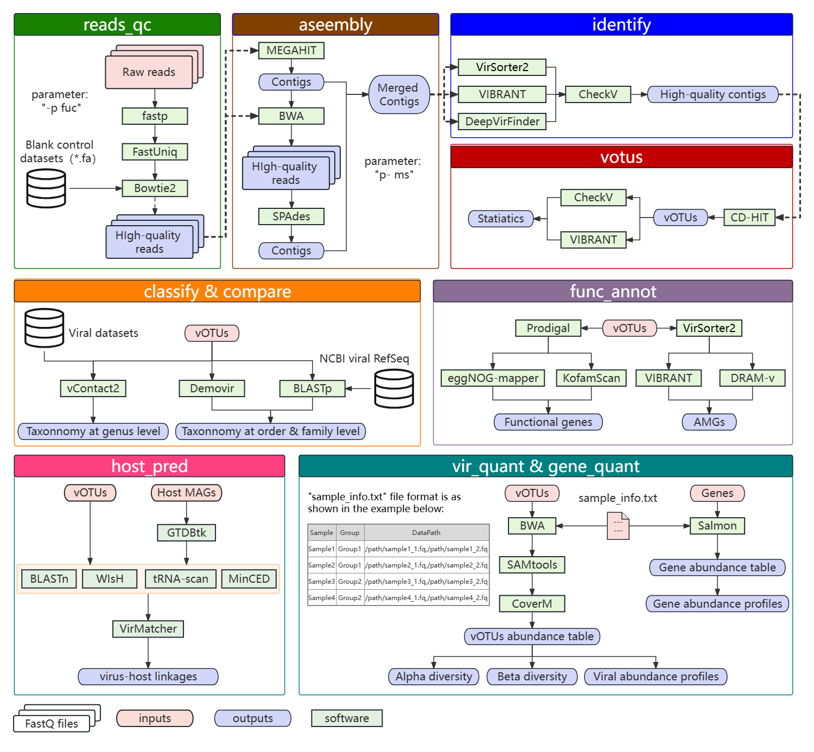

# VirCraft - a flexible bioinfomatic pipeline for viromic analysis from metagenomic data
VirCraft aims to be an **easy-to-use Viral Metagenomic Analysis Craft** that integrates a variety of tools to cover various steps of viral metagenomic analysis. VirCraft can be installed easily by executing the setup_env and setup_db modules that wrapped in VirCraft. For viral metagenoomic analysis, VirCraft compriss multiple modules for reads quality control (reads_qc module), viral assembly (assemble module), identification of viral contigs (identify module), viral operational taxonomic units (vOTUs) clustering (votus module), viral classification (classify module), dataset comparison (compare module), viral-host linkage analysis (host_pred module), functional annotation (func_annot module), and viral and gene abundance analysis (vir_quant and gene_quant modules). VirCraft supports execution in local or cloud-based Linux systems, uses containerization technology to ensure the repeatability of calculations. While there is no single best approach for processing metagenomic data, VirCraft is meant to be a fast and simple approach before you delve deeper into parameterization of your analysis. VirCraft can be applied to a variety of environments, including gut, water, and soil microbiomes (see VirCraft paper for benchmarks). Each individual module of VirCraft is a standalone program, which means you can use only the modules you are interested in for your data.


## VIRCRAFT MODULES

Installation modules:
1) setup_env:  conda environment installation
2) setup_db:   bioinfomatic databases deployment

#### Metagemonic data pre-processing modules

3) reads_qc:   read trimming and contaminations (e.g. human) removal
4) assemble:   metagenomic assembly and QC with metaSPAdes and/or MegaHit

#### viral sequence processing modules

5) identify:    viral contig identification with VirSorter2, VIBRANT, DeepVirFinder and CheckV
6) votus:       vOTUs clustering at species level
7) classify:    conservative but accurate taxonomic annotations for vOTUs
8) compare:     compare vOTUs with other viral datasets
9) host_pred:   viral-host linkages prediction
10) func_annot: functionally annotate genes in a set of votus or viral contigs
11) vir_quant:  estimate viral abundance and execute the diversity analysis across sample by group
12) gene_quant: estimate gene abundance

## SYSTEM REQUIREMENTS
The resource requirements for VirCraft will vary greatly based on the amount of data being processed, but due to large memory requirements of many software used (such as metaSPAdes), I recommend at 8+ cores and 64GB+ RAM. VirCraft officially supports only Linux x64 systems, but may be installed on OSX manually or with docker (see below).

## INSTALLATION

#### Manual installation (this is best, if you are comfortable):
0. Install mamba: `conda install -y mamba`. Mamba will efficiently replace Conda, performing the same tasks but much faster.
1. Download or clone this ripository: `git clone https://github.com/yangm9/VirCraft.git`
2. Install the conda environments for VirCraft: `mkdir tmp_envs && /your_path/virCraft.py setup_env -o tmp_envs`. 
*Note: the "tmp_envs" will be a temporary directory to deposit the intermediate files for installing conda environment, so this directory can be deleted after the installation is complete. Additionally, if the installation fails, rerun the installation commands frequently until the all conda environments are installed.*
3. Deposit the bioinformatic databases for VirCraft: `mkdir vc_db && /your_path/virCraft.py setup_db -o vc_db`
4. (Optional) In the step 2 and 3, In Step 2 and Step 3, the user can install the conda environment by manually running these scripts by adding the "-u" parameter option on the command line. For example:
```
#step 2. Install the conda environments for VirCraft:
mkdir tmp_envs && /your_path/virCraft.py setup_env -o tmp_envs
#step 3. Deposit the bioinformatic databases for VirCraft:
mkdir vc_db && /your_path/virCraft.py setup_db -o vc_db
```


#### Docker installation


## DETAILED PIPELINE WALKTHROUGH




## USAGE

```
virCraft.py -h
usage:
        ./virCraft.py -h [<options>] -o <outdir>
        subcommands: an optional functional module, including assembly, identify, votus, classify, compare, vir_quant, func_annot and host_prid.
        options: options described below in the section of Options.
        outdir: output directory.

VirCraft is an flexible pipeline for metaviromic data analysis.

optional arguments:
  -h, --help            show this help message and exit

subcommands:
  valid subcommands

  {reads_qc,assembly,identify,votus,classify,compare,vir_quant,func_annot,host_prid}
    reads_qc            Pair-end FastQ reads qualitiy control.
    assembly            Assemble the reads to contigs or scaffolds using
                        MegaHit and/or SPAdes
    identify            identify the viral contigs from a assembly fasta,
                        using vir-id-sop
    votus               construct the non-redundant virus operational
                        taxonomic unit (vOTU) reference
    classify            classify the virus contigs by Demovir
    compare             Compare the virus protein sequence by vContact2
    vir_quant           Calculate the abundance and diversity of each
                        microbial community
    func_annot          Gene annotation and quantification
    host_prid           Predict the hosts of virus
```

Each module is run separately. For example, to run the identify module:

```
./virCraft.py assemble -h

usage: ./virCraft.py assemble [-h] -1 STR [-2 STR] [-t INT] [-u] [-r] -o STR [-p STR] [-l INT]

options:
  -h, --help            show this help message and exit
  -1 STR, --fastq1 STR  FastQ file for read 1
  -2 STR, --fastq2 STR  FastQ file for read 2
  -t INT, --threads INT Number of processes/threads to use [default=8]
  -u, --unrun           This parameter is mainly used for debugging. If this parameter is set, the script will not run directly, but will generate scripts for each analysis step [default=False]
  -r, --clear           Remove intermediate result files generated during program execution to save storage space [default=False]
  -o STR, --outdir STR  Output folder [default is the current folder]
  -p STR, --process STR Select the optional analysis process of assembly (s and/or c), i.e. "-p ms". Among these, "m" and/or "s" represent the assembly tool of MEGAHIT and/or SPAdes. i.e. "ms" refer to the process as follows: 1) assemble the reads to metagenome using MEGAHIT, 2) map all reads back to the assembled contigs and get the unmapped reads, 3) assemble the unmapped reads with SPAdes, and 4) merge the assembly results from 2) and 3) [default="ms"]
  -l INT, --cutoff INT  The minimal length of contigs/scaffolds. [default=1500]
```

## Acknowledgements

Author of pipeline: [Ming YANG](yangm@idsse.ac.cn)

Institution: [Institute of Deep-sea Science and Engineering，Chinese Academy of Sciences](http://www.idsse.cas.cn/)

